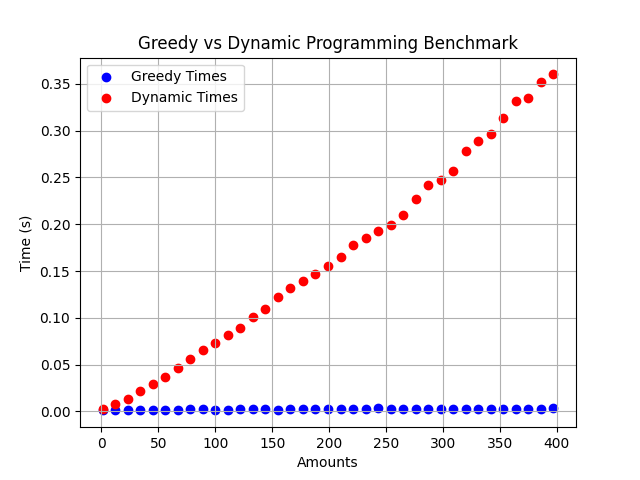
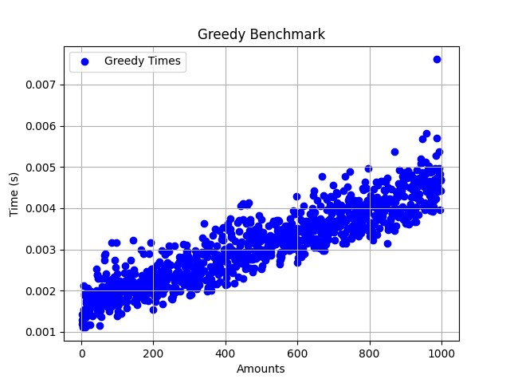

# Жадібні алгоритми та динамічне програмування

### Результати вимірів часу роботи алгоритмів

 

## Висновки

1. Розглянуто задачу видачі решти мінімальною кількістю монет за допомогою жадібного алгоритму та динамічного програмування;
2. Жадібний алгоритм не завжди досягає кінцевого результату, що продемонстровано на прикладі неповного набору монет (відсутній номінал 1 копійка);
3. Як видно з графіків, складність обох алгоритмів лінійна O(n), проте час виконання алгоритму динамічного програмування значно більший через необхідність ітеруватись по масиву більшого розміру.

### Примітка

Напевно, більш точно, складність алгоритмів O(n x m), але в даному випадку, оскільки кількість номіналів монет стата,
можна вважати складність лінійною.
